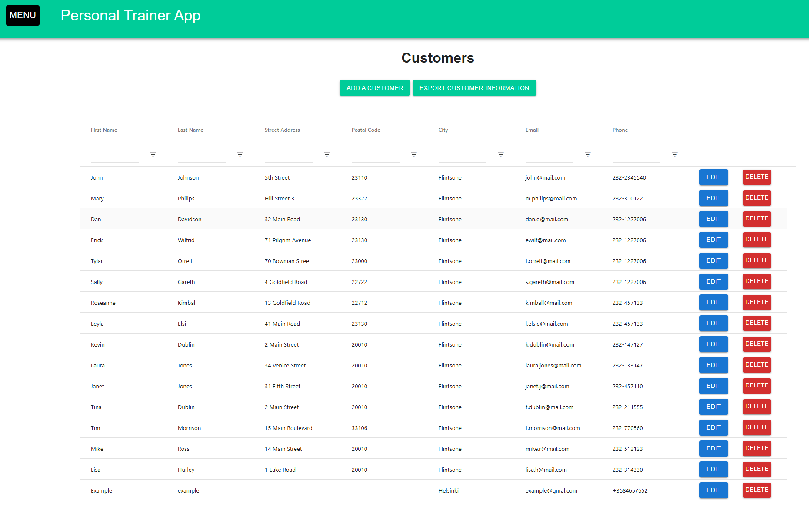
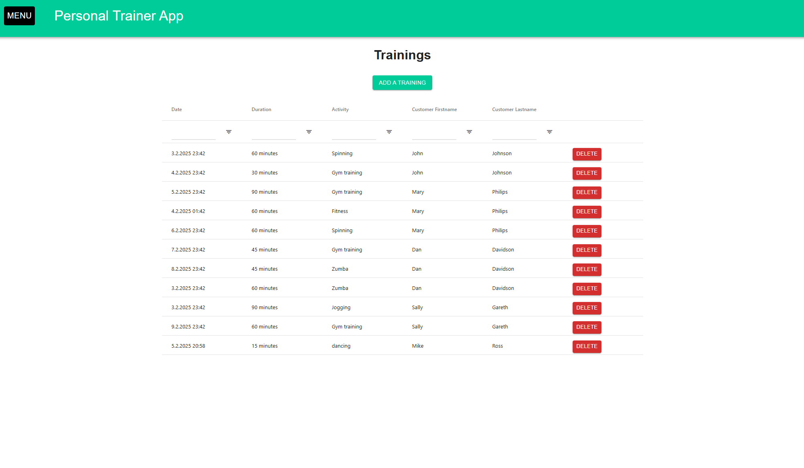
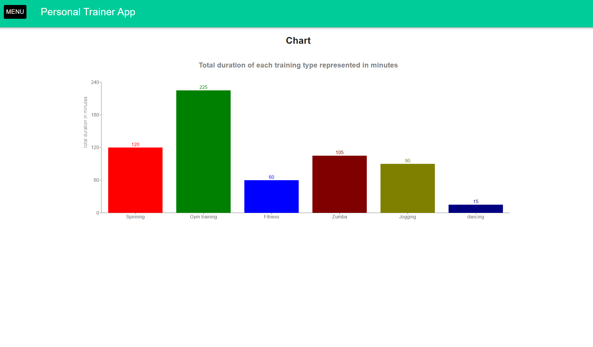

# Personal Trainer Application

## Overview
Frontend built with JavaScript and React for an imaginary personal trainer business.

## Deployment
Live version deployed here: https://joakha.github.io/personal-trainer-app/

## Application Screenshots
<div style="display: flex; flex-wrap: wrap; gap: 10px;">
  
  
  
  
</div>

## Features
- **Customer Management**: User can add, edit and delete customer info. User can view customer details like name, address and so on. User can filter and sort customers based on selected criteria.
- **Trainings Management**: User can assign trainings to customers, view training info, delete trainings, 
sort and filter trainings based on selected criteria.
- **CSV-export**: User can generate a csv file containing customer information for later use.
- **Trainings Calendar**: Calendar makes it easy to track booked trainings schedule.
- **Training Charts Data**: Bar chart helps track what kinds of trainings are booked.

## Installation
1. Clone the repository:
    ```sh
    git clone https://github.com/joakha/personal-trainer-app.git
    ```

2. Install dependencies:
    ```sh
    npm install
    ```

4. Start development server:
    ```sh
    npm run dev
    ```

## Dependencies

### UI & Styling:
- @mui/material - Material-UI components
- @emotion/react - CSS-in-JS library
- @emotion/styled - Styled components for Emotion

### Date & Time Handling:
- @mui/x-date-pickers - MUI date pickers
- date-fns - JavaScript date utility library
- dayjs - Lightweight date library

### Data Grids & Charts:
- ag-grid-community - Feature-rich grid/table component
- ag-grid-react - React wrapper for ag-Grid
- recharts - Charts & graphs for React

### Routing & Utility:
- react-router-dom - Client-side routing for React
- lodash - Utility functions for JavaScript

### Calendar:
- react-big-calendar - Calendar component for React